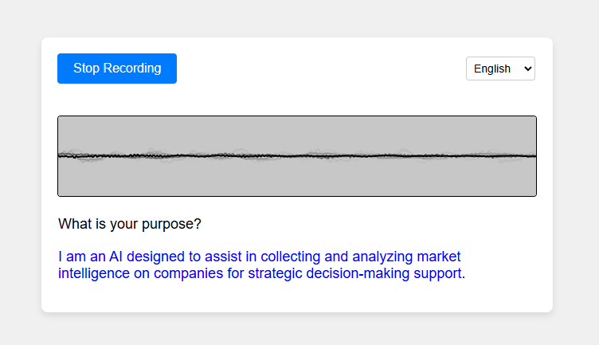

<p align="center">
    
    <h1 align="center">Voice Bot Assessment</h1>
    <p align="center"><b>Voice bot app with a tool calling agent.</b>
</p>

## 🙌 Overview

I built a fully scalable, live production voice bot. This voice bot utilizes an agent that has access to multiple tools, including Google Search and Web Scraping, with the potential to add more. 

It supports multiple languages, allowing users to choose between Spanish, English, and Armenian, catering to clients who speak these languages. 

This voice bot acts as a Market Intelligence Analyst, helping to answer your questions and reading the output aloud to maintain the voice experience.




## 🔧 Stack

App details:
- **Frontend:** HTML, CSS, and JavaScript Vanilla.
- **API:** FastAPI (Python).
- **Technologies:** Git/Github, Docker.
- **Cloud Deployment:** Microsoft Azure (Container Registry + Web App).

Agent details:
- **Agent:** Langchain (Python).
- **Agent tools:** Google Search using SerpAPI API and Scraping Website.
- **LLM:** `gpt-4-1106-preview` with `temperature=0`.


## 💡 How does it work?

- The user asks a question by voice.
- The audio is transcribed using `webkitSpeechRecognition`.
- The transcribed audio is sent to an endpoint of my API, `/process_text`, to get the answer.
- The agent uses the following prompt: `You are a Market Intelligence Analyst...`. It will try to answer the question using its knowledge and the two available tools: `Google Search` and `Web Scraping`.
- The answer is returned and displayed in blue letters on the frontend.

Check the full pipeline:


## 🐳 Docker

### Build the Docker image, version 1.0
```
docker build -t voice_chat_demo:1.0 .
```

**-t:** tags

### Build the Docker container
```
docker run -p 80:80 voice_chat_demo:1.0
```

**-p:** publish

## 🎉 Microsoft Azure Deployment

Using Container Registry + Web App

---

### Tag the Docker image version
```
docker tag voice_chat_demo:1.0 voicebotcontainer.azurecr.io/voice_chat_demo:1.0
```

### Login Azure
```
docker login voicebotcontainer.azurecr.io
```

### Push the image
```
docker push voicebotcontainer.azurecr.io/voice_chat_demo:1.0
```

## 🔎 Development Progress of the Voice Bot

### Screenshot 1: Ensuring Voice Reception and Transcription Works
Description: This screenshot shows the initial development phase where the primary focus was on ensuring that the voice input is correctly received and transcribed using webkitSpeechRecognition. This step was crucial for the core functionality of the voice bot.


### Screenshot 2: Adding Multilanguage Support and Improving UI
Description: In this stage, multilingual capabilities were added, allowing users to choose between Spanish, English, and Armenian. Additionally, the user interface was enhanced for a better user experience. The screenshot captures the updated UI and language selection feature.


### Screenshot 3: Connecting UI with the Agent
Description: The final stage involved integrating the frontend with the backend agent. This screenshot demonstrates the connection between the UI and the /process_text API endpoint, which processes the transcribed text and returns the response. The UI displays the response in blue text, maintaining the voice interaction experience.

